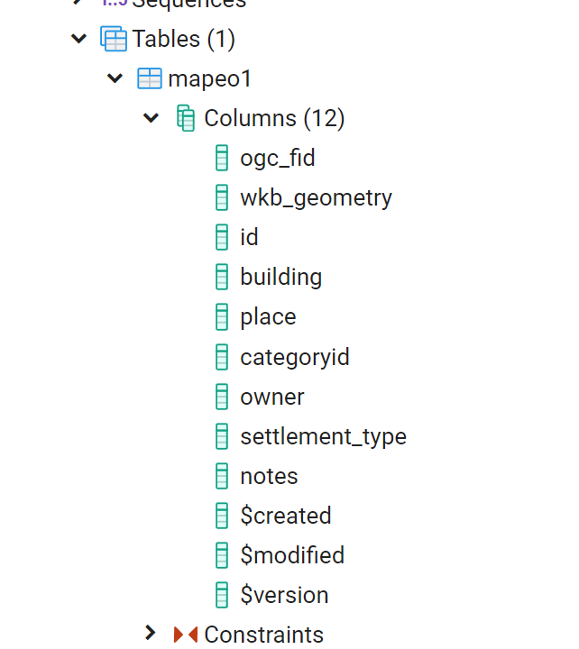

## Helpful Links for Using Your Exported GeoJSON File 

[Using ogr2ogr to convert GeoJSON to PostGIS database or shapefiles](https://morphocode.com/using-ogr2ogr-convert-data-formats-geojson-postgis-esri-geodatabase-shapefiles/)

[GDAL ogr2ogr documentation](https://gdal.org/programs/ogr2ogr.html)

[GDAL site with download information](https://gdal.org/)

[geojson.io](https://geojson.io/#map=2/20.0/0.0)

[About geojson.io](https://geojson.io/about.html)

[QGIS site with download information](https://qgis.org/en/site/)

[Leaflet site](https://leafletjs.com/)

## Export your Observation Data as a GeoJSON
## Documents to Download

---

### [GeoJSON Export to Map or Database PDF no Images](docsPDF/Sync.pdf)

### [GeoJSON Export to Map or Databse PDF ](docsPDF/SynchIMG.pdf)

---

## Videos To Download

### [Export Observations as GeoJSON](videos/ExportGeoJSON.mov)

---

---

## Example of Script to Create New Table with ogr2ogr
    
    If we want to specify a destination table, we can use the -nln table option. In order to append the new data to the already existing records, we can use the -append flag:
---
    ogr2ogr -f "PostgreSQL" PG:"host=localhost port=5432 user='USERNAME' password=PASSWORD dbname='mapeotest'" "C:\mapeoDBTest\mapeo-observation-data.geojson" -nln "mapeo1" -append

